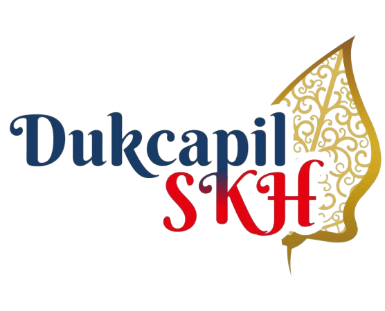

<div align="center">
  
  <h1>Sub-Prasojo Web</h1>
  <p><strong>Dashboard Pelayanan Adminduk secara Online Masyarakat Sukoharjo</strong></p>
  
  <p>
    Sistem web sub-dashboard interaktif untuk mengelola dan memantau pelayanan administrasi kependudukan (Adminduk) secara online bagi masyarakat di wilayah Sukoharjo.
  </p>

  <div>
    
    
    
    
    
    
    
    
    
  </div>
</div>

---

## ⚡ Tech Stack

Aplikasi ini dibangun dengan mengutamakan performa, arsitektur modular, dan *developer experience* yang baik. 

### 🏗️ Arsitektur & Framework
- **Framework:** Next.js (App Router)
- **Bahasa Utama:** TypeScript
- **Arsitektur Utama:** Server-Side Rendering (SSR), Component-Based Architecture & Repository Pattern

### 🎨 Antarmuka & Styling
- **Styling:** Tailwind CSS
- **Ikonografi:** RemixIcon
- **Grafik & Chart:** ApexCharts
- **Loading State:** React Loading Skeleton

### 🛠️ Manajemen Data, API, & Form
- **Data Fetching:** Axios
- **State Management & Sinkronisasi Data:** TanStack Query (React Query)
- **Manajemen Form:** React Hook Form
- **Skema Validasi Form:** TypeBox
- **Manajemen Media / Aset:** Cloudinary

### ⚙️ Manajemen Package & Toolchain
- **Package Manager:** Bun
- **Linting & Formatting:** Biome

---

## 🚀 Memulai Proyek (Getting Started)

### Prasyarat Instalasi
Pastikan Anda sudah menginstal **[Bun](https://bun.sh/)** di perangkat Anda sebelum menjalankan perintah di bawah ini.

### 1. Instalasi Dependensi
Jalankan perintah ini di dalam *root directory* proyek untuk mengunduh semua package:
```bash
bun install
```

### 2. Jalankan Dev Server
```bash
bun dev
```

### 3. Lihat Hasil
Buka browser dan akses **[http://localhost:3000](http://localhost:3000)**. 
Perubahan pada kode Anda (misalnya di `src/app/page.tsx`) akan secara otomatis tertampil pada browser.

---

## 👨‍💻 Linting & Formatting

Kami menggunakan [Biome](https://biomejs.dev/) untuk memastikan seluruh format kode seragam serta mencegah *error* bawaan.

Untuk mengecek *linter*:
```bash
bun run lint
```

Untuk melakukan format otomatis:
```bash
bun run format
```
